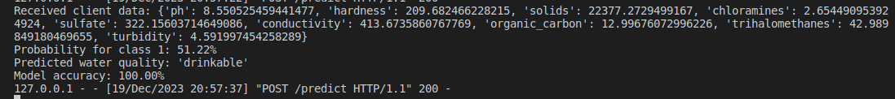
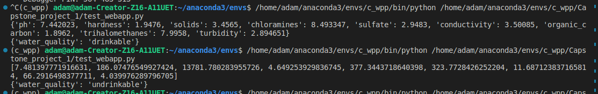
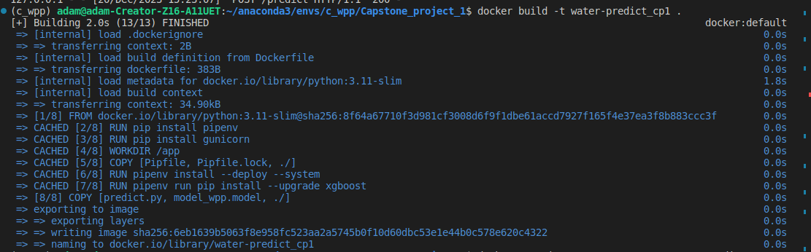
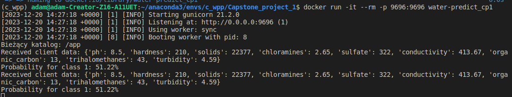
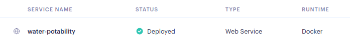
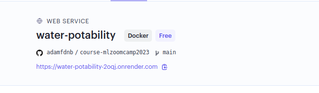
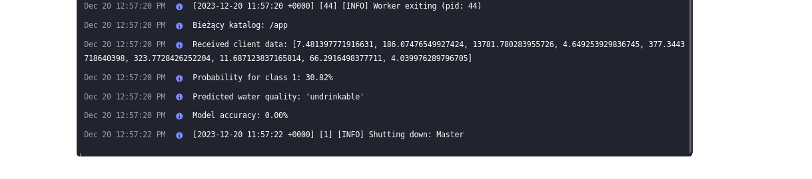

# Predicting the drinkability of water
## "Your health starts with clean water!"

<p align="center">
  
</p>


*photo is from [https://torrentlab.com](https://torrentlab.com)/*

#### This repository contains a Capstone project 1 conducted as part of the [Machine Learning Zoomcamp](https://github.com/alexeygrigorev/mlbookcamp-code/tree/master/course-zoomcamp) online course designed and taught by [Alexey Grigorev](https://github.com/alexeygrigorev) and his team from [DataTalks.Club](https://datatalks.club/). This project lasted 2 weeks. The idea behind this project is to implement everything we learned in the last 10 weeks of classes.

## Contents:
1. problem & goal description
2. about the dataset
3. problem solving approach<br>
3.1 EDA to understand the dataset<br>
3.2 Training the model<br>
3.3 Implementing the model in the cloud<br>
4. development system<br>
   4.1 Deploy Model with Flask<br>
   4.2 Deploying Model Locally with Docker<br>
   4.3 Cloud Deploying <br>
5. Summary with conclusions

### 1. Problem & Goal Description

Ensuring access to safe drinking water is not only a health issue, but also a fundamental right for everyone. It is a key component of effective health policy, with important developmental implications at various levels - from national to regional to local levels.
Analyses indicate that investments in water and sanitation infrastructure bring net economic benefits, as the reduction in negative health effects and health care costs exceeds the cost of implementing appropriate solutions. As a result, access to safe water becomes an important factor not only for individual well-being, but also for sustainable social development
The goal of this project is to build Tto develop and evaluate machine learning models capable of predicting the potability of drinking water based on its physical characteristics. This project aims to contribute to improved water quality assessment and identification of potential water quality issues. I spent many hours exploring data and tuning models

## 2. About the Dataset

You can get the dataset from [kaggle](https://www.kaggle.com/datasets/adityakadiwal/water-potability)
I have prepared a code in notebook that imports a set of data from within notenook. You will need an individual API Token downloaded from Kaggle. [Details](https://github.com/Kaggle/kaggle-api)

The Water Potability dataset contains information about water quality, including its suitability for human consumption. It contains 3266 observations, each of which represents a water sample. Each observation contains 9 features:

1. pH
2. Total Hardness
3. Chlorides
4. Electrical Conductivity
5. Nitrates
6. Phosphates
7. Total Organic Carbon
8. Ammoniacal Nitrogen
9. Sulfates

The dependent variable is the quality of the water, which may be undrinkable or drinkable 

10. Potability: Indicates if water is safe for human consumption where 1 means Potable and 0 means Not potable.


## 3. Problem solving approach
### 3.1 EDA to understand the dataset

I performed the following EDA for this dataset:

+ Data loading: Loading data into the program for further analysis.
  + In order to fill in the missing data, I have grouped the data with ph and the corresponding ranges according to the accepted standards 
+ Analysis of missing values: Analysis of missing values in the data
  + After completing the data, checked the covariance and correlation,
  + Used box plots to determine outliers
  + In the end, I created two datasets on which to conduct research. The second data set was cleaned of outliers
+ Variable distribution analysis: Analyzing the distribution of variables in the data, such as mean, median, standard deviation, etc.
+ Correlation and covariance analysis to identify relationships between data features

## 3.2. Training the model

I tested seve models and tuned hyperparameters to optimize their performance. A short summary: 

### Logistic Regression | Random Forest Classifier| Gaussian Naive Bayes

+ The Random Forest model tends to overfit the training data, as evidenced by its perfect accuracy on the training datasets but lower accuracy on the testing datasets. Logistic Regression and Naive Bayes exhibit more stable performance but struggle to predict the positive class, especially on the original data. The models trained on the cleaned dataset do not consistently outperform their counterparts trained on the original data. Naive Bayes, the accuracy on the training dataset is 63.16%, indicating moderate performance. The performance on the testing dataset is consistent with the training dataset, with an accuracy of 62.96%.

### Support Vector Machine (SVM) 

+ It seems like the SVM model with different values of the regularization parameter C (0.001, 0.01, 0.1, 1, 10, 100) is not performing well on both the training and testing sets. The accuracy is around 60-63%, and the confusion matrix and classification report show that the model is not effectively distinguishing between the two classes (0 and 1). The precision, recall, and F1-score for class 1 are consistently low, indicating that the model struggles to correctly identify instances of class 1.

### KNeighbors Classifier

+ Overfitting: The models, especially with fewer neighbors, seem to overfit the training data, resulting in a significant drop in performance on the testing set. Class Imbalance: The models struggle to perform well on the positive class, possibly due to class imbalance.

### XGBClassifier with GridSearchCV

+ The cross-validation results indicate that the XGBClassifier model is able to achieve a reasonable level of accuracy in predicting the potability of drinking water, with average test set accuracies ranging from 68.54% to 72.65%. The best performing hyperparameters vary depending on the dataset (original or cleaned), but generally involve a learning rate (eta) of 0.1, a maximum depth between 3 and 6, a minimum child weight between 1 and 7, a number of estimators between 25 and 100, and a subsample of 0.7.
+ The models trained on the cleaned dataset generally achieved slightly higher accuracy compared to the models trained on the original dataset. This suggests that the cleaning process may have removed some noise or irrelevant features that were negatively impacting the model's performance.
+ The XGBClassifier model shows promising results for predicting the potability of drinking water. Further optimization of hyperparameters and exploration of different data preprocessing techniques could potentially improve the model's performance.

  + Finally, preparing the data, training the XGBClassifier model and saving it to the ``` model_wpp.model ``` file was prepared in the ``` train.py ``` file. 
Having the model prepared, you can easily import it in the future to make predictions on new data.


## 5. Development system
### To deploy Model with Flask 

1. To activate a virtual environment using Pipenv on a Linux system, follow these steps:
	- Open a terminal in your Linux system.
 	- Navigate to the directory where your project is located or create a new directory for your project if you haven't already.
  	- Use the + ```pipenv install``` command to create a new virtual environment and install the project's dependencies.
     + This command will automatically create a Pipfile and Pipfile.lock and set up a virtual environment in your project directory.
       
2. To activate the virtual environment, use the
   	+ ```pipenv shell```
	+ After running this command, you will be inside the activated virtual environment, which means that all Python commands and packages installed within this environment will be available.

3. This line of code is to install all the necessary dependencies listed in the Pipfile files of the virtual environment.
   	+ ``` pip install name_of_package ```
   
4. Run service app (predict.py)
   	+ ``` python predict.py ```
 	+ ``` pipenv run python predict.py ``` / if using virtual environment

5. Run test file in a sepearate virtual environment terminal (test.py)
	+ ``` python test.py ```
 	+ ``` python test_webapp.py ``` / if you are using network services / remember to specify your own address



	+ ``` python test_webapp.py ``` / if you are using network services / remember to specify your own address


    

### Deploying Model Locally with Docker
#### Install and run docker on local machine
About Docker [Docker overview](https://docs.docker.com/get-started/overview/)
1. Installing Docker
Docker is a tool that makes it easy to create, deploy and run applications in containers. Containers are isolated units that contain everything you need to run an application,including code, the execution environment, libraries and other dependencies. Overall, Docker speeds up development processes, makes it easier to deploy and manage applications, and improves the consistency of the environment between different stages of the application lifecycle.

	- Ubuntu 

```bash
sudo apt-get install docker.io
```
Install and run docker, follow [more information about installation](https://docs.docker.com/engine/install/ubuntu//) <br>
or using the resources of [DataTalskClub](https://github.com/DataTalksClub/machine-learning-zoomcamp/blob/master/05-deployment/06-docker.md)
 
2. Build docker image in terminal

  +  ``` docker build -t water-predict_cp1 . ```

Remember that you must be in the project folder :
You can check what folder you are currently in in the Linux terminal using the pwd command. pwd stands for "print working directory" and will display the full path to the current directory.

```bash
pwd
```



3. Run docker image:
  - ``` docker run -it --rm -p 9696:9696 water-predict_cp1 ```



### Cloud Deploying 

To deploy the application in the cloud, I used [Render](https://docs.render.com/docs/docker), which is a unified cloud for creating and running all applications and websites








5. Run test file test water quality prediction app in cloud
	+ ``` python test_webapp.py ``` / if you are using network services / remember to specify your own address
 	+ in order to improve the transfer of data for prediction, it is possible to transfer data in various formats: list, dict, DataFrame or numpy array


## 6. Summary with conclusions

### Data preparation:
Proper data preparation is crucial to the effectiveness of the model.
Converting column names to lowercase, converting spaces to underscores and converting values in the evaluation column allowed for better data representation.

### Analysis and comparison of models:
I tested four different models: Logistics Regresion, Support Vector Machine, Random Forest Classifier, Gaussian Naive Bayesr, K-Nearest Neighbors Classifier and XGBClassifier with GridSearchCV. I used different hyperparameters to optimize each model.

### Model evaluation:
I evaluated the models using various metrics such as Accuracy Score, Classification Report, Confusion Matrix, ROC AUC Score, Precision, Recall, ROC Curve, Mean Squared Error, R-squared, F1 Score and AUC.
I tested the models on different subsets of data (training, validation, testing) to evaluate their overall performance and two datasets

### Model selection:
Based on the test results, I decided to use the XGBClassifier model with following hyperparameters 
```
{
    `eta': 0.1,
    'max_depth': 5,
    'min_child_weight': 5,
    'n_estimators': 25,
    'subsample': 0.7,
    'objective': 'binary:logistic',
    'use_label_encoder': False
}
```

### Model:
The final XGBClassifier model was saved in the model_mqp.model, which makes it easy to reuse the model for forecasting on new data.

### Model performance:
The final model achieved high accuracy on the validation set, suggesting that the model is effective in predicting milk class classes based on available characteristics. 
I will continue to develop this project using neural networks. 
