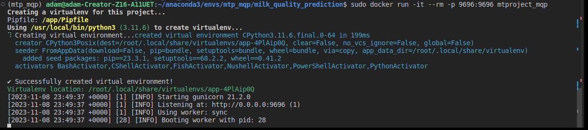

# Milk Quality Prediction
### "Fast, Accurate, and Cost-Effective: Predictive Models in Milk Quality Assessment for Dairy Production Efficiency."


*photo is from https://www.rnz.co.nz/*

#### This repository contains a midterm project conducted as part of the [Machine Learning Zoomcamp](https://github.com/alexeygrigorev/mlbookcamp-code/tree/master/course-zoomcamp) online course designed and taught by [Alexey Grigorev](https://github.com/alexeygrigorev) and his team from [DataTalks.Club](https://datatalks.club/). This project lasted 2 weeks. The idea behind this project is to implement everything we learned in the last 6 weeks of classes.

## Contents:
1. problem & goal description
2. about the dataset
3. problem solving approach<br>
3.1 EDA to understand the dataset<br>
3.2 Training the model<br>
3.3 Implementing the model in the cloud<br>
4. development system<br>
   4.1 Deploy Model with Flask<br>
   4.2 Deploying Model Locally with Docker<br>
   4.3 Cloud Deploying <br>
5. Summary with conclusions

### 1. Problem & Goal Description
Milk quality is an important factor affecting its nutritional value, taste, shelf life and safety. Evaluation of milk quality can be done on the basis of various physical parameters, such as pH, temperature, taste, odour, fat, turbidity and colour. These parameters can be measured using simple laboratory methods or electronic sensors. However, these methods can be time-consuming, expensive. Therefore, in my opinion, there is a need to develop predictive models that can quickly and accurately predict milk quality based on available data.

The goal of this project is to build and compare different machine learning models that can predict milk quality based on physical characteristics. 

## 2. About the Dataset

You can get the dataset from [kaggle](https://www.kaggle.com/datasets/cpluzshrijayan/milkquality/data). 

The data I am using in this project was collected manually from observations. The dataset contains more than 1000 observations.
We can divide the dataset into 7 independent variables, i.e. pH, temperature, taste, odor, fat, turbidity and color an one dependend variable: Grade

1. pH: This characteristic determines the pH of the milk, which ranges from 3 to 9.5.
2. Temperature: This characteristic determines the temperature of the milk, and it ranges from 34'C to 90'C.
3. Taste: This characteristic determines the taste of the milk and takes possible values: 1 (good) or 0 (bad).
4. Odor: This characteristic determines the smell of milk and takes possible values: 1 (good) or 0 (bad).
5. Fat: This characteristic determines the fat content of the milk and takes possible values: 1 (good) or 0 (bad).
6. Turbidity: This characteristic determines the turbidity of the milk and takes possible values: 1 (good) or 0 (bad).
7. Color: *This characteristic determines the color of the milk, which ranges from 240 to 255.

The dependent variable is the grade of milk, which can be good, average or bad. 

8. Grade: This is the target value and takes the values: low_quality, medium_quality or high_quality.

## 3. Problem solving approach
### 3.1 EDA to understand the dataset
I performed the following EDA for this dataset:

+ Data loading: Loading data into the program for further analysis.
+ Analysis of missing values: Analysis of missing values in the data 
+ Variable distribution analysis: Analyzing the distribution of variables in the data, such as mean, median, standard deviation, etc.
+ Correlation analysis: Analyzing correlations between variables in the data to identify relationships between them.

## 3.2. Training the model

I tested four models and tuned hyperparameters to optimize their performance. A short summary: 

### Logistic Regression

+ The model seems to be performing reasonably well with an accuracy of around 0.75 on both the training and test datasets. The predictions for the first five examples look quite close to the actual expectations, with some minor discrepancies.

### DecisionTreeClassifier

+ I performed fine-tuning of the hyperparameters, testing different values of max_depth. Visualizing the RMSE values for different max_depth values is a nice touch - it provides a clear picture of the model's performance at different depths. <br>
The excellent accuracy of 1.0 in the test dataset raises concerns that over-fitting may be occurring. 

### Random Forest Classifier

+ Very interesting work with the Random Forest classifier! Extensive exploration of various values of max_depth and n_estimators, combined with visualizations, shows good recognition in tuning the model.
The balance in accuracy across training, validation and test data sets is impressive, indicating a well generalized model. The confusion matrix provides a deeper understanding of model performance in each class.

### KNeighbors Classifier

+ Based on the results, it appears that the K-Nearest Neighbors (KNN) model achieves very high accuracy on both the test and validation sets. <br>
In the case of KNN, too low values of the n_neighbors parameter can lead to over-fitting. For values of n_neighbors=1, the model may try to "remember" the training data instead of generalizing the patterns, which can lead to problems on new data.

Finally, preparing the data, training the RandomForestClassifier model and saving it to the ``` model_mqp.pkl ``` file was prepared in the ``` train.py ``` file. 
Having the model prepared, you can easily import it in the future to make predictions on new data.


## 5. Development system
### To deploy Model with Flask 

1. To activate a virtual environment using Pipenv on a Linux system, follow these steps:
	- Open a terminal in your Linux system.
 	- Navigate to the directory where your project is located or create a new directory for your project if you haven't already.
  	- Use the + ```pipenv install``` command to create a new virtual environment and install the project's dependencies.
     + This command will automatically create a Pipfile and Pipfile.lock and set up a virtual environment in your project directory.
       
2. To activate the virtual environment, use the
   	+ ```pipenv shell```
	+ After running this command, you will be inside the activated virtual environment, which means that all Python commands and packages installed within this environment will be available.

3. This line of code is to install all the necessary dependencies listed in the Pipfile files of the virtual environment.
   	+ ``` pip install name_of_package ```
   
4. Run service app (predict.py)
   	+ ``` python predict.py ```
 	+ ``` pipenv run python predict.py ``` / if using virtual environment

5. Run test file in a sepearate virtual environment terminal (test.py)
	+ ``` python test.py ```
 	+ ``` python test_webapp.py ``` / if you are using network services / remember to specify your own address


    

### Deploying Model Locally with Docker
#### Install and run docker on local machine
About Docker [Docker overview](https://docs.docker.com/get-started/overview/)
1. Installing Docker
Docker is a tool that makes it easy to create, deploy and run applications in containers. Containers are isolated units that contain everything you need to run an application,including code, the execution environment, libraries and other dependencies. Overall, Docker speeds up development processes, makes it easier to deploy and manage applications, and improves the consistency of the environment between different stages of the application lifecycle.

	- Ubuntu 

```bash
sudo apt-get install docker.io
```
Install and run docker, follow [more information about installation](https://docs.docker.com/engine/install/ubuntu//) <br>
or using the resources of [DataTalskClub](https://github.com/DataTalksClub/machine-learning-zoomcamp/blob/master/05-deployment/06-docker.md)
 
2. Build docker image in terminal

  +  ``` docker build -t mtproject_mqp . ```

Remember that you must be in the project folder :
You can check what folder you are currently in in the Linux terminal using the pwd command. pwd stands for "print working directory" and will display the full path to the current directory.

```bash
pwd
```


3. Run docker image:
  - ``` docker run -it --rm -p 9696:9696 mtproject_mqp ```



### Cloud Deploying 

To deploy the application in the cloud, I used Render, which is a unified cloud for creating and running all applications and websites


5. Run test file test milk quality prediction app in cloud
	+ ``` python test_webapp.py ``` / if you are using network services / remember to specify your own address


## 6. Summary with conclusions

### Data Preparation:
Correct data preparation is crucial to the effectiveness of the model. Converting column names to lowercase, converting spaces to underscores, and transforming values in the grade column allowed for better data representation.

### Analysis and Comparison of Models:
Tested four different models:Logistics Regresion, Decision Tree Classifier, Random Forest Classifier and K-Nearest Neighbors Classifier.I used various hyperparameters to optimize each model.

### Evaluation of Models:
I evaluated the models using various metrics such as accuracy (accuracy), RMSE (Root Mean Squared Error) and confusion matrix (confusion matrix).
I tested the models on different subsets of data (training, validation, testing) allows to evaluate their overall performance.

### Model Selection:
Based on the test results, I decided to use the RandomForestClassifier model with hyperparameters n_estimators=5 and max_depth=5.

### Model:
The final RandomForestClassifier model was saved to the model_mqp.pkl file, making it easy to reuse the model for forecasting on new data.

### Model Performance:
The final model achieved high accuracy on the test set, suggesting that the model is effective in predicting milk grade classes based on available characteristics.
